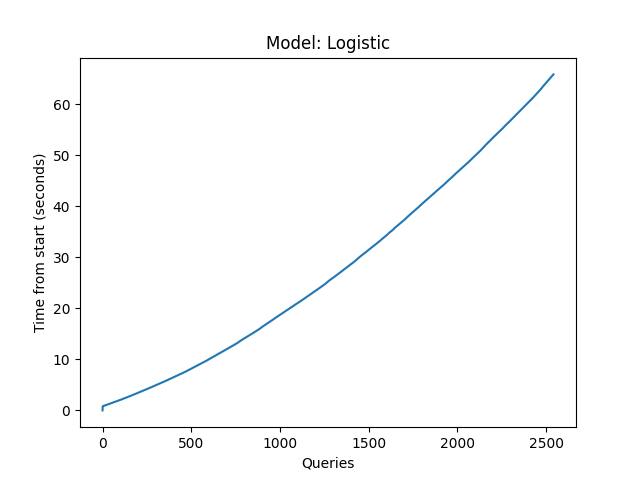
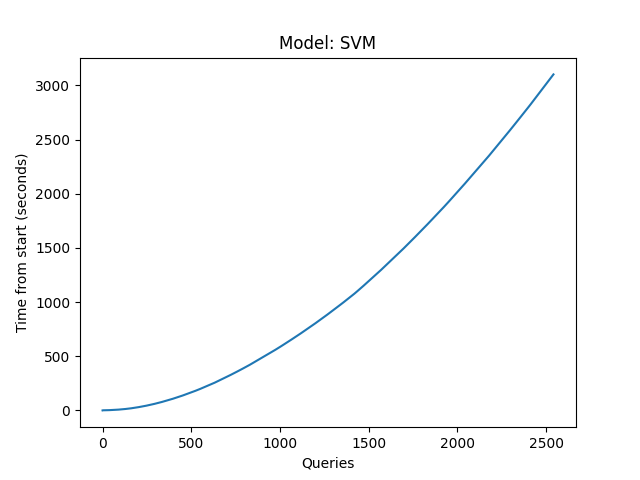
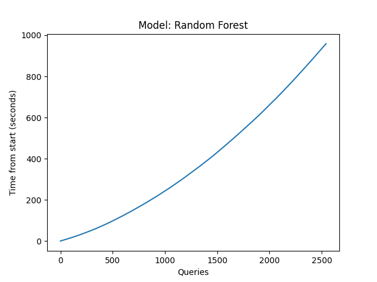
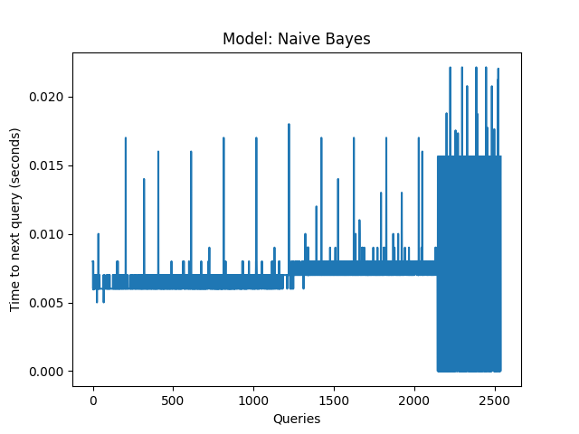
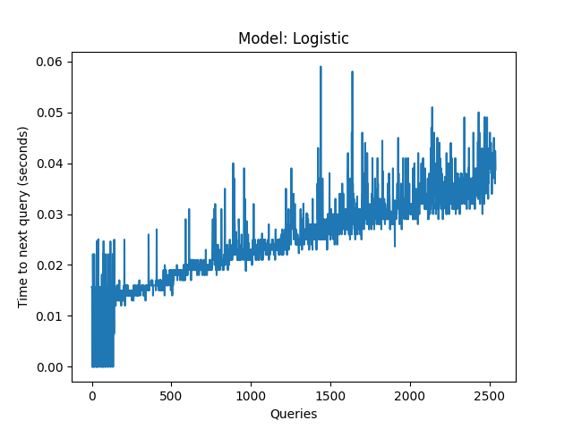
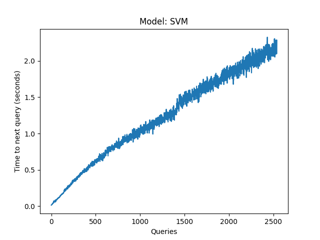
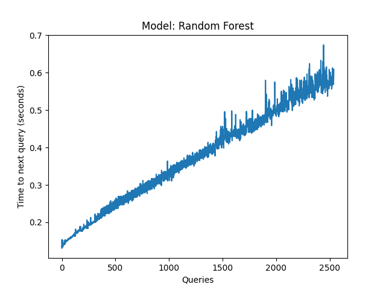

# DEPRECATED: No longer supported. Only works with version 0 of ASReview.

# asreview-simulation-time

This is a repository containing python functions for creating time related plots for asreview. At the moment there are two kinds of plots you can create. The 'time_from_start'-plot and the 'time_between_queries'-plot. The first type of plot as the queries on the x-axis and the time between the start of the simulation to the current query on the y-axis. The second type of plot has the same x-axis, and the time from the current to the next query on the y-axis.

## Time-from-start plots

## Time-between-queries plots

# License and Contact
This repository is under an Apache 2.0 license. Contact: @PeterLombaers
